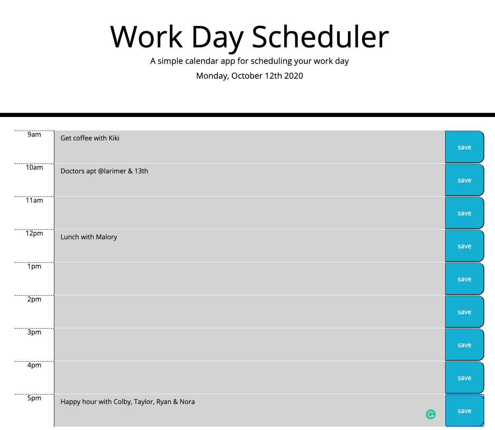

# day_planner

Description
This is a day planner that will save your meetings. Users can insert their plans for the day. The current hour will show as red, fututre hours are green, and past hours are grey. Simple enter your plans for the hour and press save. Your inputs will be stored so you never lose what you have scheduled.
 

## Usage
Write all of youar activities for the day and press save buttons on the right hand side. All of your activities will be stored. All hours in the past will be grey. Future hours will be green, and the current hour will be bright red. 

###### Technologies Used
The main tech used was JavaScript, HTML, and CSS. This code was created on Visual Studio and renders were checked on Google Chrome. 

## Problems I faced
Somehow my relative path on my folders were corrupted so I had to create a new repo, folder, and files which was pretty frustrating. The loop also took me a long time to get through and a few extra eyes.

### Link
[Link to the day planner](https://andreaives.github.io/day_planner/)

## Credits
Most of the credit goes to my tutor and my classmates Tyler Bolty, Taylor Hackbart, Jessica Anocibar, and Brendon Hart. Thanks guys!

